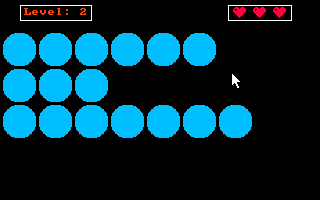

# Nim-Asm
A clone of the game [Nim](https://en.wikipedia.org/wiki/Nim) I wrote in 80x86 16-bit assembly
as a project for high school. The game graphics were inspired (more accurately copied since I have
zero skills in anything related to art and graphics) from the online game
[Pearls before swine](https://www.gamesflow.com/jeux.php?id=2226106).




## Rules
In the game, there are rows of pearls. In your turn, you can remove as many pearls as you want from
a single row. The goal is to leave the last pearl for your opponent. You have 5 levels to complete
and 3 lives (tries).

In your turn, mark the pearls you wish to remove and then press `ENTER`. Then, the computer will
play his turn. Press `R` to reset the level (and lose a life) and press `ESCAPE` to exit the game.

Note that the computer is smart, and **one wrong move** is all it takes to lose the game.

## Installation
In order to compile and run the game follow these steps:

1. Clone or download the repository to your computer.
2. Download and install [dosbox](https://www.dosbox.com/download.php?main=1). This program emulates
an old DOS system with a 80x86 16-bit Intel CPU.
3. After dosbox is installed, open its settings file `dosbox-VERSION.conf` with a text editor,
where `VERSION` is the version of dosbox (0.74-3 at this time).
If you have trouble locating this file, run dosbox and look at the console. It usually prints the
location of this file.
Once the file is opened in a text editor, modify the following settings:
	* Under `[autoexec]` add the following block of code:
		```
		@echo off
		mount D: {REPO_PATH}
		D:
		set PATH=%PATH%;D:\TASM\
		```
		and replace `REPO_PATH` with the path to the cloned repository on your computer.
		This will mount the drive `D:` to this repository, so that dosbox treats it as its file
		system (dosbox will see this repository as its `D:` drive).

		In addition, the `TASM` directory will be added to the `PATH` environment variable of
		dosbox, so the assembly compiler, linker and debugger are available at the command prompt
		of dosbox.
	* **(Optional)** Under the `[sdl]` section, set `fullresolution` to your screen resolution
	(for example: `1920x1080`) and `output` to `ddraw`. This will make the emulator work better
	when using full screen (can be used by the keyboard shortcut Alt+Enter). The default settings
	tend to change your screen resolution in full screen mode and move other windows around which
	I find annoying.
	* **(Optional)** Under `[sdl]` set `windowresolution` to the window size you prefer.
4. Open dosbox. If the previous step was done correctly, typing the command `dir` in the console
should print this repository's contents. Navigate to the `Nim` directory: `cd NIM`.
5. A pre-compiled `NIM.EXE` program is provided in the `NIM` directory. Alternatively, you can
compile the program using the included `TASM` assembler:
	* Compile `NIM.ASM` by running the command `tasm /zi NIM.ASM`. The `/zi` option creates debug
	symbols which could be useful.
	* Link the program by running `tlink /v NIM.OBJ`. The `/v` option creates debug symbols. This
	will create the executable `NIM.EXE`.
7. Finally, run the pre-compiled or generated `NIM.EXE` and play the game.
